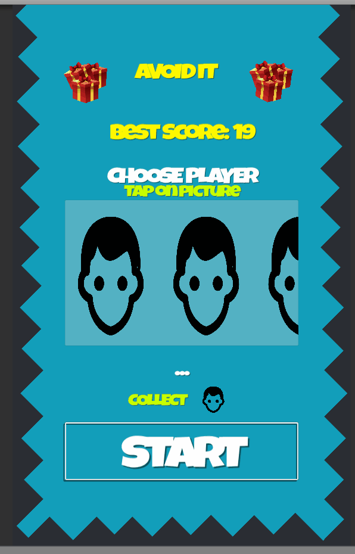
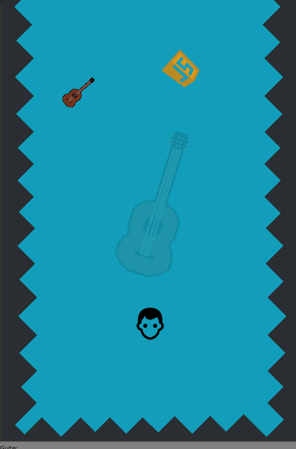

# Avoid it
Collect you items! Avoid others! Simple rules!

Game was created for fun and to challange myself (I gave myself 6hours) 
## Table of Contents

- [Game Rules](#game-rules)
- [Demo gif](#demo-gif) 
- [APK](#apk)

## Game rules #
You have to pick one character, in demo it's just simple human face (player is scriptable object, so it can be easily edited)
1. Each character has original item to collect and must avoid other items. (In background always is seen your item to collect)
  - For collecting correct item, you are getting points
2. Controller is inspired by joystic 
  - By holding and draging finger on screen you simulate character movement
  - You can tap anywhere on screen to move
## Demo gif
### Start Menu

### Gameplay

## APK ##
AvoidIT.apk 
Androind 5.0 + 
23mb free space
